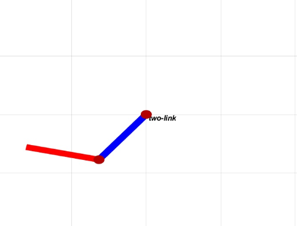
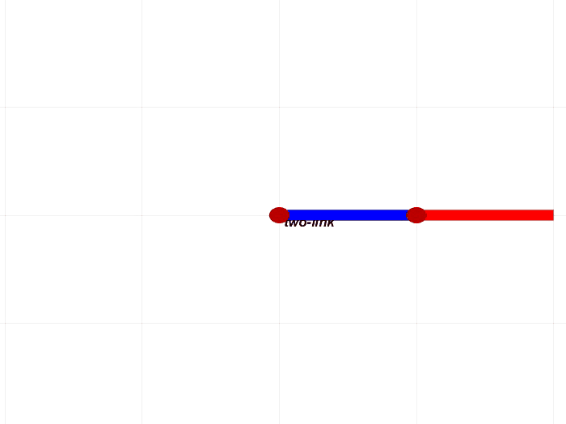
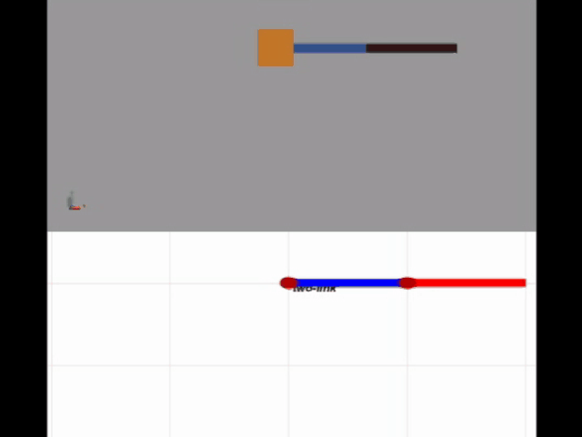

# 写在前面

本文使用的工具为matlab以及Peter Corke的[RTB](https://petercorke.com/toolboxes/robotics-toolbox/)(Robotics Toolbox)。基于RTB 10.3.1版本，我写了[RTE](https://github.com/star2dust/Robotics-Toolbox)(Robotics Toolbox Extension)，增加了一些移动机器人、机械臂以及路径规划相关代码。同时，RTE也修复了原RTB的一些小bug。

听说最近RTB出了10.4，不知道bug修复完没有，有用过的同学可以谈谈感想。个人建议这篇文章最好用我GitHub里的RTE工具箱，下载点[这里](https://github.com/star2dust/Robotics-Toolbox)。安装方法见README文件，写的很详细了。

本文的任务是利用matlab和RTB建模2连杆机械臂的动力学，并与matlab自带的simulink/simscape仿真进行对比，验证RTB建模的正确性。本文并不涉及控制部分，只是教大家如何建模真实的多刚体系统。

# 2连杆机械臂

我们要研究的是竖直平面上的2连杆机械臂，也可以说是双摆。因为本文不做控制，所以我们要模拟机械臂在重力的作用下运动的过程。



[这里](https://star2dust.github.io/post/matlab-rtb-two-link/)给出2连杆机械臂的动力学建模过程，之后可以代入数值验证代码正确性。

# RTB建模

- 给出物理参数
```matlab
lx = 1; lr = 0.1;  % 连杆的长度和半径
gy = 9.81;  % 重力加速度(这里在y轴方向，因为z轴是关节转动轴)
fvis = 0; fcou = 0; % 粘性摩擦系数和库伦摩擦系数
```
- 建立连杆模型
这里的`Cuboid`和`Cylinder`都是我自己基于RTB写的类。
```matlab
rod = Cuboid([lx,lr,lr]); % 建立成长方体
Irod = rod.inertia; % 可以直接获得转动惯量
```
这里建立成圆柱也行，获得转动惯量时需要进行一个刚体变换。
```matlab
rod = Cylinder(lr,lx);
Rcyl = SO3.rpy([0 -pi/2 0]);
Irod = Rcyl.R*rod.inertia*Rcyl.R';
```
- 机械臂建模
```matlab
% 设定dh参数，质量，关节质心距离，关节约束，转动惯量，摩擦系数
dpm = {'a', lx, 'm', rod.mass, 'r', [-lx/2,0,0],...
 'qlim', [-pi/2, pi/2],'I', Irod,...
    'B', fvis, 'Tc', [fcou -fcou]};
% 建立2连杆机械臂，设定回转关节和重力
r = SerialLink([Revolute(dpm{:}),Revolute(dpm{:})],...
'name','two-link','gravity',[0 gy 0]);
```
经过以上步骤，2连杆机械臂建模完成，设置关节角`qz`，可以画出机械臂。
```matlab
ws = [-4 4 -4 4 -4 4]; % 设置工作空间
plotopt = {'workspace', ws, 'nobase', 'notiles', 'noshading', 'noshadow', 'nowrist','top'}; % 设置绘图参数
h = r.plot(qz,plotopt{:});
```

# 仿真与验证

我们这里验证2连杆机械臂在重力作用下运动过程，即双摆实验。
```matlab
% 给定初始关节角位置和速度
qz = zeros(1,2);
qd = zeros(1,2);
% 设定仿真时间10s
y0 = [qz,qd]'; tspan = [0 10]; 
% 刚体仿真用ode15s比较快，用accel函数直接获得关节加速度
tic
[tlist,ylist] = ode15s(@(t,y) [y(r.n+1:end);r.accel(y(1:r.n)',y(r.n+1:end)',zeros(1,r.n))],tspan,y0);
toc
% 差不多6s可出结果，然后画出机械臂即可
ws = [-4 4 -4 4 -4 4];
plotopt = {'workspace', ws, 'nobase', 'notiles', 'noshading', 'noshadow', 'nowrist','top'};
h = r.plot(ylist(:,1:r.n),plotopt{:});
```
实验结果如下图所示。


下面进行simulink/simscape的双摆仿真，对比实验如下图所示，可以看到前面几乎是同步的。

如何使用simscape搭建一个双摆系统，可以参考b站[这个视频](https://www.bilibili.com/video/BV1X741147a5)。



# 源代码

本文所需全部源代码已上传至[我的GitHub](https://github.com/star2dust)，点击[这里](https://github.com/star2dust/two-link)下载。运行`two_link_test.m`即可。使用前请确认RTB已经正确安装，下载和安装说明点击[这里](https://github.com/star2dust/Robotics-Toolbox)。

使用simulink/simscape做的双摆仿真也在该仓库里，见`link_test.slx`，但是需要matlab里有simscape的工具箱，否则打不开。另外matlab版本最好在2018b以上。

如果喜欢，欢迎点赞和fork。


